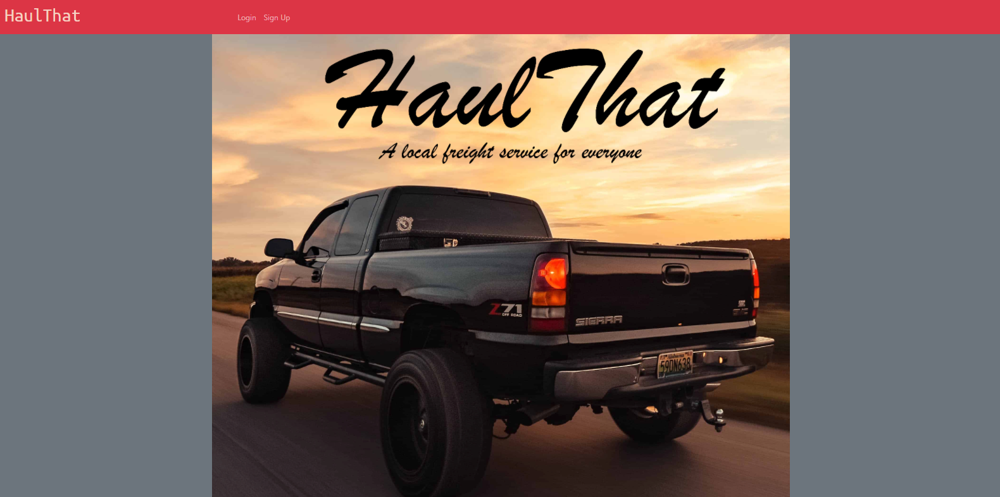
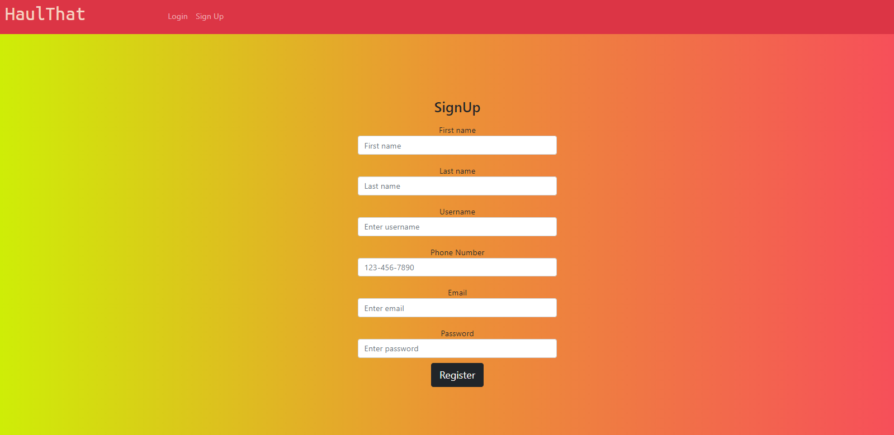
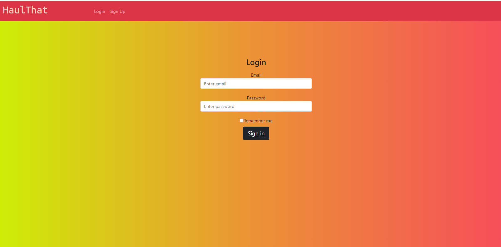

# Haul-That

## Description
Haul-That is an interactive MERN application. Moving!? Need a truck!? Haul-That provides a P2P communication method in which the customers and carriers can connect easily. You are able to sign up, create an account 
## Table of Contents
* [Link](#link)
* [Screenshot](#Screenshot)
* [License](#license)
* [Questions](#questions)

## Link
Checkout out the app!
https://agile-beyond-53405.herokuapp.com/

## Screenshot

## License
Haul-That is licensed under the MIT License.

## Questions
