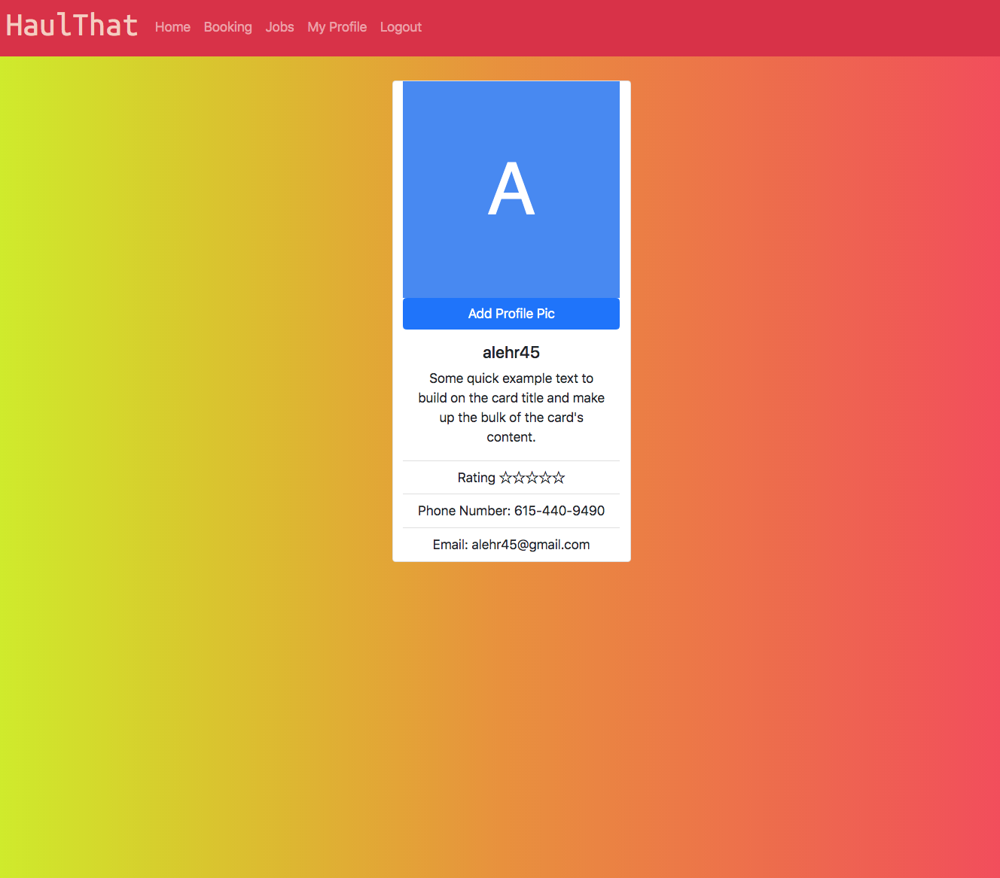

# Haul-That

## **Table of Contents**
========================
* [Description](#description)
* [Website](#website)
* [Contributors](#contributors)
* [Installation](#installation)
* [Technologies](#Technologies)
* [Licensing](#Licenses)
* [Contact](#questions)

========================

### **Repository Name**  
# haul-that

### **Description**  
A P2P frieght delivery service that helps those without a truck or trailer, move or deliver large items on demand and in a timeline favorable to the user themselves. Haul-That also provides jobs for those who are looking for additional employment throughout the day and are in possession of a hauling vehicle.

### **Website**  
https://haul-that.herokuapp.com/

### **Installation**
Currently having trouble with Heroku deployment.
To run locally:
clone repo, 
run `npm install`,
then run `npm start` from root.

### **Usage**  

### **Contributors**  
##### @alehr45@gmail.com
##### @Zakonik13
##### @william-hunt88
##### @Dustymick
##### @hadeediqbal

### **Technologies**  
#### React
#### React-Bootstrap
#### Google Maps API
#### JWT
#### becrypt
#### Apollo
#### Figma
#### Twillio

### **License**  
  

This application is covered by the Mozilla license. 

========================

### Questions?
hadeediqbal@yahoo.com

========================
